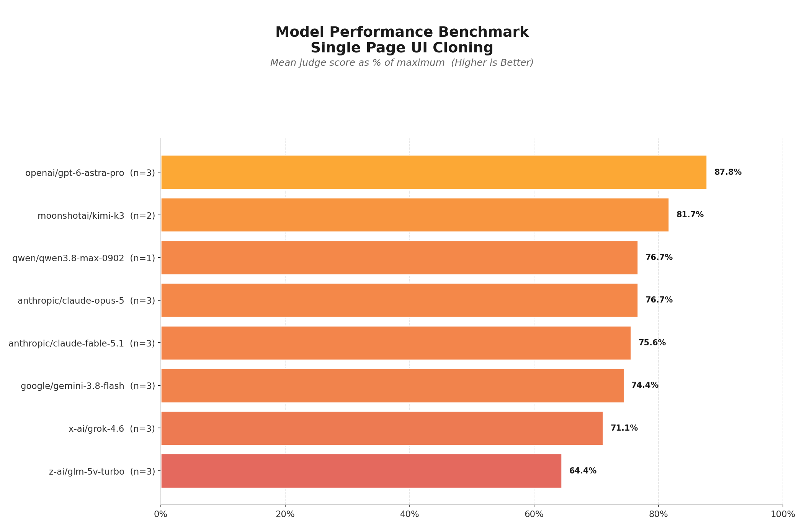

# Clone UI Bench

A LLM as a Judge bench to evaluate web UI cloning ability using a multimodal judge.

## Results

Latest run: a 3-URL pilot across 8 frontier models, scored by a 3-judge panel.



| Model | Score | n | Cost / clone |
| --- | --- | --- | --- |
| openai/gpt-6-astra-pro | **87.8%** | 3 | $0.855 |
| moonshotai/kimi-k3 | 81.7% | 2 | $0.396 |
| qwen/qwen3.8-max-0902 | 76.7% | 1 | $0.128 |
| anthropic/claude-opus-5 | 76.7% | 3 | $0.177 |
| anthropic/claude-fable-5.1 | 75.6% | 3 | $0.299 |
| google/gemini-3.8-flash | 74.4% | 3 | $0.041 |
| x-ai/grok-4.6 | 71.1% | 3 | $0.053 |
| z-ai/glm-5v-turbo | 64.4% | 3 | $0.017 |

Scores are the mean judge score as a percentage of the maximum (10). Pilot spend was **$8.03** for 22 completed tasks.

### Examples

Target versus clone for the top four models, all on `stripe.com`. Each model is
screenshotted separately, so the targets differ slightly - a live page moves
between captures, and the judge always compares a clone against its own target.

#### openai/gpt-6-astra-pro — 8.7/10

| Target | Clone |
| --- | --- |
|  |  |

#### moonshotai/kimi-k3 — 7.7/10

| Target | Clone |
| --- | --- |
|  |  |

#### qwen/qwen3.8-max-0902 — 7.7/10

| Target | Clone |
| --- | --- |
|  |  |

#### anthropic/claude-opus-5 — 7.3/10

| Target | Clone |
| --- | --- |
|  |  |


### Self-preference check

Two panel members (`gemini-3.8-flash`, `grok-4.6`) also compete, and `gpt-6-astra` is a sibling of `gpt-6-astra-pro`. Per-judge scores are kept precisely so this is measurable:

| Judge | Own family | Other models | Gap |
| --- | --- | --- | --- |
| google/gemini-3.8-flash | +0.56 | +0.02 | +0.54 |
| x-ai/grok-4.6 | +0.56 | +0.19 | +0.37 |
| openai/gpt-6-astra | +0.22 | −0.48 | +0.70 |


### Estimated cost of a full run

Extrapolated from measured pilot costs — 8 models × 20 URLs, 3 judges:

| | |
| --- | --- |
| Clones (160 tasks) | $39.33 |
| Judging (480 calls) | $19.29 |
| **Total** | **~$59** |

## Requirements

- Python 3.12+
- uv
- API keys for the AI models you want to test

## Installation

1. Install dependencies:

```bash
uv pip install .
```

2. Set up environment variables in `.env` file with your API keys.

## Usage

### Basic Usage

Run the benchmark with default settings (3 parallel requests, using built-in models and URLs):

```<bash
python -m src.main
```

### Command Line Arguments

The script accepts the following command line arguments:

| Argument     | Short | Type    | Default | Description                                                |
| ------------ | ----- | ------- | ------- | ---------------------------------------------------------- |
| `--parallel` | `-p`  | integer | 3       | Number of parallel requests to run simultaneously          |
| `--config`   | `-c`  | string  | None    | Path to JSON configuration file containing models and URLs |
| `--judge`    | `-j`  | string  | None    | Comma-separated judge model ids, overriding the config      |
| `--help`     | `-h`  | -       | -       | Show help message and exit                                 |

### Configuration File Structure

- **`models`** (array): List of model identifiers to test
- **`urls`** (array): List of website URLs to clone
- **`judges`** (array, optional): Judge models forming the scoring panel. `judge` (a single string) is accepted as shorthand.

Both `models` and `urls` arrays are required if using a config file. If no config file is provided, the script uses built-in default values.

### Judging

Each clone is scored by a **panel** of judges rather than a single model, and every judge's score is kept in its own column alongside the mean. Averaging across labs dilutes any one judge's preference for its own family, and keeping the per-judge scores means that bias can be measured rather than assumed away.

### Default Configuration

If no config file is specified, the benchmark uses these defaults:

**Models:**

- openai/gpt-6-astra-pro
- anthropic/claude-opus-5
- anthropic/claude-fable-5.1
- google/gemini-3.8-flash
- x-ai/grok-4.6
- qwen/qwen3.8-max-0902
- moonshotai/kimi-k3
- z-ai/glm-5v-turbo

**Judges:**

- google/gemini-3.8-flash
- x-ai/grok-4.6
- openai/gpt-6-astra

**URLs:**

- https://stripe.com
- https://airbnb.com
- https://github.com
- https://dribbble.com
- https://medium.com
- https://spotify.com
- https://netflix.com
- https://apple.com
- https://google.com
- https://twitter.com
- https://linkedin.com
- https://instagram.com
- https://youtube.com
- https://amazon.com
- https://slack.com
- https://discord.com
- https://figma.com
- https://notion.so
- https://vercel.com
- https://tailwindcss.com

### Performance Considerations

- **Parallel Requests**: Higher parallel request counts can speed up execution but may hit API rate limits
- **Total Tasks**: The benchmark runs `number_of_models × number_of_urls` total tasks, each costing one clone call plus one call per judge
- **Example**: 7 models × 20 URLs = 140 tasks = 140 clone calls + 420 judge calls

### Output

The benchmark saves results to:

- **Screenshots**: `data/og/` and `data/clone/` directories (organized by model)
- **Results**: `data/results.csv` containing scores and metadata

Key columns:

| Column | Meaning |
| --- | --- |
| `judge_score` | Mean across the judges that returned a usable score |
| `judge_score::<model>` | That judge's individual score, `NaN` if it failed |
| `judge_response::<model>` | That judge's full written analysis |
| `judge_models` | The panel used for the row |
| `error` | Why a row scored 0, e.g. a response missing the required blocks |
| `clone_cost` / `judge_cost` / `total_cost` | Credits spent, as reported by OpenRouter |
| `clone_prompt_tokens` / `clone_completion_tokens` | Token counts for the clone call |

#### Output Result Structure

```
data/
├── og/ # Original website screenshots
├── clone/ # AI-generated clone screenshots
└── results.csv # Benchmark results and scores
```

### Plotting

```bash
python -m src.plot [results.csv] [-o output.png]
```

Defaults to `data/results.csv` and writes `resources/image.png`. Scores are plotted as the mean judge score per model expressed as a percentage of the maximum, with the task count on each label. A mean rather than a total, so a model that lost rows to API failures isn't silently penalised.

## Todos:

- [x] Test simple web ui cloning with simple image inputs.
- [ ] Evolve the test tasks to provide the llm assets like images and icons to use.
- [ ] Run training experiments on a small vlm with RL and judge reward.
